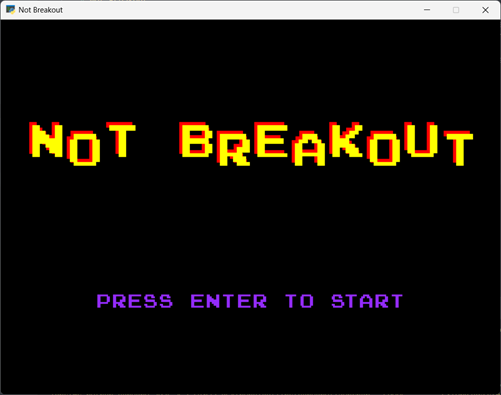
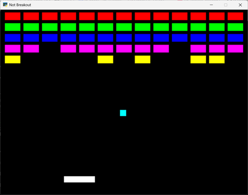

# Not Breakout

This is a game similar to the old arcade title Breakout. I wrote it as an exercise in learning SDL and refreshing my knowledge of Python from my university data science courses. Some of the things it demonstrates include:
- Use of a static type checker in the form of Mypy
- Classes and interfaces (abstract base class with do-nothing methods... seems similar to pure virtual methods in C++)
- Use of ctypes and byref to work with a C-based library, in this case SDL
- Operator overloading for a 2D Vector class
- Use of a state pattern to implement switching between intro and game

To run:
- Create a .venv virtual environment
- Install the packages from the requirements.txt manifest
- python main.py
- Arrow keys to move paddle, Escape to quit

